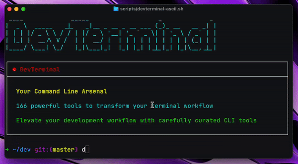

# Awesome-DevTerminal: The Developer's Comprehensive CLI Arsenal

A meticulously curated collection of 166 powerful command-line tools organized by category to enhance developer productivity, streamline workflows, and transform your terminal into a robust development environment. Our community goal is to reach 500+ quality tools through contributions while maintaining high curation standards.

## What makes this collection different?

- **Comprehensive scope**: With 166 tools organized into intuitive categories (and growing toward our goal of 500+), this is becoming one of the most extensive CLI collections available
- **Developer-focused**: Each tool has been selected with the developer workflow in mind
- **Practical descriptions**: Clear, concise explanations of what each tool does and why you might want it
- **Maintained links**: Direct paths to each project's repository or website for easy discovery
- **Community-curated**: Continuously improved through the contributions of developers who use these tools daily

Whether you're a terminal novice looking to level up your skills or a seasoned command-line veteran seeking new tools for your arsenal, DevTerminal has something for everyone.

## How to use this list

Browse by category to discover tools for specific needs, or use your browser's search functionality to find tools related to particular technologies or tasks. Each entry includes a brief description and a direct link to the project.

Contributions welcome! If you know of a great CLI tool that's not listed here, please submit a pull request.

## Contents

- [DevTerminal: The Developer's Comprehensive CLI Arsenal](#devterminal-the-developers-comprehensive-cli-arsenal)
  - [What makes this collection different?](#what-makes-this-collection-different)
  - [How to use this list](#how-to-use-this-list)
  - [Contents](#contents)
  - [System Monitoring and Information](#system-monitoring-and-information)
  - [File Management](#file-management)
  - [Terminal Text Editors](#terminal-text-editors)
  - [Text Processing and Formatting](#text-processing-and-formatting)
  - [Network Tools](#network-tools)
  - [Container and Orchestration Tools](#container-and-orchestration-tools)
  - [Display and Visual Effects](#display-and-visual-effects)
  - [Terminal Utilities and Shells](#terminal-utilities-and-shells)
  - [Development and Version Control](#development-and-version-control)
  - [Data Visualization and Analytics](#data-visualization-and-analytics)
  - [AI and Machine Learning](#ai-and-machine-learning)
  - [Security and Privacy](#security-and-privacy)
  - [Productivity and Organization](#productivity-and-organization)
  - [Contributing](#contributing)
  - [License](#license)

## System Monitoring and Information

- [neofetch](https://github.com/dylanaraps/neofetch) - Feature-rich system info script with ASCII/image logo.
- [pfetch](https://github.com/dylanaraps/pfetch) - Simple system information tool written in POSIX sh.
- [btop](https://github.com/aristocratos/btop) - Resource monitor showing CPU, memory, network, and storage usage.
- [htop](https://github.com/htop-dev/htop) - Interactive process viewer and system monitor.
- [atop](https://www.atoptool.nl) - Advanced system and process monitor for Linux.
- [s-tui](https://github.com/amanusk/s-tui) - Terminal-based CPU stress and monitoring utility.
- [macmon](https://github.com/aronpn/macmon) - Sudoless performance monitoring for Apple Silicon processors.
- [cpufetch](https://github.com/Dr-Noob/cpufetch) - Simple yet fancy CPU architecture fetching tool.
- [glances](https://github.com/nicolargo/glances) - Cross-platform monitoring tool with web interface option.
- [duf](https://github.com/muesli/duf) - Disk Usage/Free Utility with colorful output.
- [ncdu](https://dev.yorhel.nl/ncdu) - Disk usage analyzer with ncurses interface.
- [dust](https://github.com/bootandy/dust) - More intuitive version of du in Rust.
- [bottom (btm)](https://github.com/ClementTsang/bottom) - Cross-platform graphical system monitor.
- [bpytop](https://github.com/aristocratos/bpytop) - Resource monitor that shows usage and stats.
- [tuptime](https://github.com/rfmoz/tuptime) - Like uptime(1), but preserves shutdown/restart stats.
- [pumas](https://github.com/visionmedia/pumas) - Power Usage Monitor for Apple Silicon.

## File Management

- [exa](https://github.com/ogham/exa) - Modern replacement for ls with more features.
- [eza](https://github.com/eza-community/eza) - Maintained fork of exa, a modern ls alternative.
- [ranger](https://github.com/ranger/ranger) - VI-inspired file manager for the console.
- [nnn](https://github.com/jarun/nnn) - Fast and flexible terminal file manager.
- [mc](https://midnight-commander.org) - Midnight Commander, a feature-rich visual file manager.
- [fd](https://github.com/sharkdp/fd) - Simple, fast alternative to find.
- [fzf](https://github.com/junegunn/fzf) - Command-line fuzzy finder for files and more.
- [broot](https://github.com/Canop/broot) - New way to see and navigate directory trees.
- [zoxide](https://github.com/ajeetdsouza/zoxide) - Smarter cd command for faster navigation.
- [vifm](https://vifm.info) - File manager with curses interface, vi-like environment.
- [erdtree](https://github.com/solidiquis/erdtree) - General purpose filesystem and disk-usage utility.
- [lf](https://github.com/gokcehan/lf) - Terminal file manager inspired by ranger.
- [felix](https://github.com/kyoheiu/felix) - TUI file manager with vim-like key mapping.
- [termscp](https://github.com/veeso/termscp) - TUI file transfer and explorer with SCP/SFTP/FTP/S3 support.
- [smartcat](https://github.com/daniel-araujo/smartcat) - Enhanced cat command with additional features.
- [pls](https://github.com/dhruvkb/pls) - Prettier and powerful ls(1) alternative.
- [tre](https://github.com/dduan/tre) - Modern alternative to the tree command.

## Terminal Text Editors

- [vim](https://www.vim.org) - Highly configurable text editor.
- [neovim (nvim)](https://neovim.io) - Hyperextensible Vim-based text editor.
- [nvchad](https://github.com/NvChad/NvChad) - Neovim config focused on speed and aesthetics.
- [LazyVim](https://github.com/LazyVim/LazyVim) - Feature-rich neovim config for the lazy.
- [AstroNvim](https://github.com/AstroNvim/AstroNvim) - Aesthetic and feature-rich neovim config.
- [micro](https://github.com/zyedidia/micro) - Modern and intuitive terminal-based text editor.
- [nano](https://www.nano-editor.org) - Simple text editor for beginners.
- [emacs](https://www.gnu.org/software/emacs) - Extensible, customizable, free/libre display editor.
- [flowcontrol](https://github.com/Textualize/flowcontrol) - Programmer's text editor with modern features.
- [moe](https://github.com/Xeverous/moe) - Command line Nim based editor inspired by Vim.
- [amp](https://github.com/jmacdonald/amp) - Complete text editor for your terminal.
- [kakoune](https://github.com/mawww/kakoune) - Modal editor with multiple selections capability.
- [helix](https://github.com/helix-editor/helix) - Post-modern terminal text editor.

## Text Processing and Formatting

- [mdp](https://github.com/visit1985/mdp) - Command-line based markdown presentation tool.
- [mdcat](https://github.com/lunaryorn/mdcat) - Fancy cat for markdown.
- [glow](https://github.com/charmbracelet/glow) - Render markdown on the CLI with style.
- [bat](https://github.com/sharkdp/bat) - Cat clone with syntax highlighting and Git integration.
- [jq](https://github.com/jqlang/jq) - Lightweight and flexible command-line JSON processor.
- [fq](https://github.com/wader/fq) - JQ for binary formats - query binary files.
- [sd](https://github.com/chmln/sd) - Intuitive find & replace CLI (sed alternative).
- [sttr](https://github.com/abhimanyu003/sttr) - CLI/TUI tool to perform 30+ string transformations on text.
- [pandoc](https://pandoc.org) - Universal markup converter.

## Network Tools

- [curl](https://curl.se) - Command line tool for transferring data with URLs.
- [wget](https://www.gnu.org/software/wget) - Network utility to retrieve files from the web.
- [httpie](https://httpie.io) - User-friendly HTTP client with JSON support.
- [dog](https://github.com/ogham/dog) - Command-line DNS client like dig but more user-friendly.
- [nmap](https://nmap.org) - Network scanner for security auditing.
- [mtr](https://github.com/traviscross/mtr) - Network diagnostics tool combining ping and traceroute.
- [bandwhich](https://github.com/imsnif/bandwhich) - Terminal bandwidth utilization tool.
- [trippy](https://github.com/fujiapple852/trippy) - TUI network diagnostics tool with visualization.
- [rsync](https://rsync.samba.org) - Fast, versatile file copying tool for remote and local files.
- [netcat (nc)](http://netcat.sourceforge.net) - TCP/IP swiss army knife for networking.
- [wireshark (tshark)](https://www.wireshark.org) - Network protocol analyzer.
- [aria2](https://github.com/aria2/aria2) - Ultra fast download utility with multi-protocol support.
- [croc](https://github.com/schollz/croc) - Easily and securely send files between computers.
- [portal](https://github.com/SpatiumPortae/portal) - Quick and easy command-line file transfer utility.
- [tran](https://github.com/abdfnx/tran) - Securely transfer and send anything between computers with a TUI.
- [curlie](https://github.com/rs/curlie) - Combines the power of curl with the ease of httpie.
- [tproxy](https://github.com/trimstray/tproxy) - CLI tool to proxy and analyze TCP connections.

## Container and Orchestration Tools

- [docker](https://www.docker.com) - Container platform.
- [podman](https://podman.io) - Daemonless container engine.
- [kubectl](https://kubernetes.io/docs/reference/kubectl) - Kubernetes command line tool.
- [k9s](https://github.com/derailed/k9s) - Kubernetes CLI to manage your clusters with a UI.
- [docker-compose](https://docs.docker.com/compose) - Define and run multi-container applications.
- [dive](https://github.com/wagoodman/dive) - Tool for exploring each layer in a docker image.
- [ctop](https://github.com/bcicen/ctop) - Top-like interface for container metrics.
- [sen](https://github.com/TomasTomecek/sen) - Terminal User Interface for containers.
- [xhyve](https://github.com/machyve/xhyve) - Lightweight OS X virtualization solution.
- [pocker](https://github.com/r-darwish/pocker) - TUI tool for Docker.
- [planor](https://github.com/mrusme/planor) - TUI client for cloud services (AWS, Vultr, Heroku, etc.).
- [lazydocker](https://github.com/jesseduffield/lazydocker) - Terminal UI for both Docker and docker-compose.

## Display and Visual Effects

- [cmatrix](https://github.com/abishekvashok/cmatrix) - Terminal program that simulates the digital rain effect from "The Matrix" movie.
- [neo](https://github.com/st3w/neo) - Advanced Matrix-style digital rain with Unicode support and 32-bit color.
- [donut.c](https://github.com/a1k0n/donut.c) - ASCII art animation displaying a rotating 3D donut in the terminal.
- [ASCII-Donut-Animation](https://github.com/OmarShehata/ASCII-Donut-Animation) - Customizable 3D spinning donut with interactive adjustments.
- [asciiquarium](https://github.com/cmatsuoka/asciiquarium) - Animated aquarium of ASCII art.
- [figlet](http://www.figlet.org) - Display large characters made up of ordinary screen characters.
- [cowsay](https://github.com/tnalpgge/rank-amateur-cowsay) - Generate an ASCII picture of a cow saying something.
- [lolcat](https://github.com/busyloop/lolcat) - Rainbow colorizer for terminal output.
- [sl](https://github.com/mtoyoda/sl) - Steam Locomotive that runs across your terminal when you typo 'ls'.
- [hollywood](https://github.com/dustinkirkland/hollywood) - Fill your console with Hollywood melodrama technobabble.
- [no-more-secrets](https://github.com/bartobri/no-more-secrets) - Recreation of the "decrypting" effect from Sneakers.
- [cbonsai](https://gitlab.com/jallbrit/cbonsai) - Grow bonsai trees in your terminal.
- [pipes.sh](https://github.com/pipeseroni/pipes.sh) - Animated pipes terminal screensaver.
- [rain.sh](https://github.com/lbgists/rain.sh) - Terminal rainfall animation.

## Terminal Utilities and Shells

- [tldr](https://github.com/tldr-pages/tldr) - Simplified man pages with practical examples.
- [cheat](https://github.com/cheat/cheat) - Create and view interactive cheatsheets on the command-line.
- [navi](https://github.com/denisidoro/navi) - Interactive cheatsheet tool for commands.
- [zsh](https://www.zsh.org) - Enhanced shell with features beyond bash.
- [fish](https://fishshell.com) - Friendly interactive shell with auto-suggestions.
- [starship](https://starship.rs) - Minimal, blazing-fast, and infinitely customizable prompt.
- [oh-my-posh](https://ohmyposh.dev) - Prompt theme engine for any shell.
- [thefuck](https://github.com/nvbn/thefuck) - Magnificent app that corrects your previous console command.
- [entr](http://eradman.com/entrproject) - Run arbitrary commands when files change.
- [gaze](https://github.com/wtetsu/gaze) - Runs a command, right after you save a file.
- [parallel](https://www.gnu.org/software/parallel) - Shell tool for executing jobs in parallel.
- [mprocs](https://github.com/pvolok/mprocs) - Run multiple commands in parallel and show output separately.
- [pv](https://www.ivarch.com/programs/pv.shtml) - Pipe Viewer - monitor progress of data through a pipeline.

## Development and Version Control

- [git](https://git-scm.com) - Distributed version control system.
- [tmux](https://github.com/tmux/tmux) - Terminal multiplexer for multiple virtual console windows.
- [zellij](https://github.com/zellij-org/zellij) - Terminal workspace with batteries included.
- [tig](https://github.com/jonas/tig) - Text-mode interface for git.
- [lazygit](https://github.com/jesseduffield/lazygit) - Simple terminal UI for git commands.
- [shellcheck](https://www.shellcheck.net) - Static analysis tool for shell scripts.
- [diff-so-fancy](https://github.com/so-fancy/diff-so-fancy) - Good-looking diffs with diff-highlight and more.
- [delta](https://github.com/dandavison/delta) - Syntax-highlighting pager for git, diff, and grep output.
- [difftastic](https://github.com/Wilfred/difftastic) - Syntax-aware diff tool for better code comparison.
- [gh](https://cli.github.com) - GitHub's official command line tool.

## Data Visualization and Analytics

- [csvlens](https://github.com/YS-L/csvlens) - CSV viewer like less but made for csv files.
- [miller](https://github.com/johnkerl/miller) - All in one swiss army knife for data processing.
- [catj](https://github.com/soheilpro/catj) - Displays JSON files in a flat format.
- [fx](https://github.com/antonmedv/fx) - Terminal JSON viewer and processor.
- [xsv](https://github.com/BurntSushi/xsv) - CSV command line toolkit.
- [dasel](https://github.com/TomWright/dasel) - Query and modify data structures using selectors.
- [jc](https://github.com/kellyjonbrazil/jc) - JSON Convert - convert command-line tool outputs to JSON.
- [flamelens](https://github.com/katef/flamelens) - Interactive flamegraph viewer in the terminal.
- [flameshow](https://github.com/laixintao/flameshow) - Flamegraph viewer in the terminal.
- [plotting](https://github.com/piccolomo/plotting) - Simple library for creating plots in terminal.
- [ttyplot](https://github.com/tenox7/ttyplot) - Realtime terminal plotting utility with data from stdin.
- [sizeof](https://github.com/tunz/sizeof) - Command-line tool to calculate the size of data structures.

## AI and Machine Learning

- [aichat](https://github.com/sigoden/aichat) - All-in-one AI powered CLI chat and copilot.
- [aider](https://github.com/paul-gauthier/aider) - AI pair programming in your terminal.
- [elia](https://github.com/darrenburns/elia) - TUI ChatGPT client built with Textual.
- [cai](https://github.com/jkulvich/cai) - Fast CLI tool for prompting LLMs.
- [chat.sh](https://github.com/peterdemin/chat.sh) - Pipeable LLM wrapper with code execution.
- [chatgpt](https://github.com/acheong08/chatgpt-api) - Simple command line integration to ChatGPT.
- [clai](https://github.com/ibm/clai) - Command Line AI to help learn shell commands.
- [ata](https://github.com/rikhuijzer/ata) - Ask the Terminal Anything: OpenAI GPT in the terminal.
- [tuxi](https://github.com/Bugswriter/tuxi) - CLI assistant for getting answers to questions instantly.
- [chatblade](https://github.com/npiv/chatblade) - Versatile CLI tool for interacting with OpenAI's ChatGPT.
- [tenere](https://github.com/pythops/tenere) - TUI for ChatGPT written in Rust.

## Security and Privacy

- [gpg](https://gnupg.org) - GNU Privacy Guard encryption.
- [age](https://github.com/FiloSottile/age) - Simple, modern and secure file encryption tool.
- [pass](https://www.passwordstore.org) - Standard unix password manager.
- [openssl](https://www.openssl.org) - SSL/TLS toolkit.
- [lynis](https://github.com/CISOfy/lynis) - Security auditing tool.
- [chkrootkit](http://www.chkrootkit.org) - Tool to locally check for signs of a rootkit.
- [rkhunter](http://rkhunter.sourceforge.net) - Rootkit detection tool.
- [hashcat](https://hashcat.net/hashcat) - Advanced password recovery utility.
- [cotp](https://github.com/replydev/cotp) - Trusted, encrypted, TOTP/HOTP authenticator.
- [steghide](https://github.com/StefanoDeVuono/steghide) - Steganography program.
- [hydra](https://github.com/vanhauser-thc/thc-hydra) - Login cracker for brute force attacks.

## Productivity and Organization

- [taskwarrior](https://taskwarrior.org) - Todo + task management.
- [calcurse](https://calcurse.org) - Calendar and scheduling application.
- [khal](https://github.com/pimutils/khal) - Calendar client.
- [ledger](https://www.ledger-cli.org) - Powerful, double-entry accounting system.
- [jrnl](https://jrnl.sh) - Command-line journal application.
- [newsboat](https://newsboat.org) - RSS / ATOM news reader.
- [tuime](https://github.com/HaSa1002/tuime) - Colorful and customizable TUI clock.
- [typioca](https://github.com/bloznelis/typioca) - Cozy typing speed tester in terminal.
- [tz](https://github.com/oz/tz) - Terminal based timezone helper.
- [todoman](https://github.com/pimutils/todoman) - Simple, standards-based CLI task-manager.
- [ttyper](https://github.com/max-niederman/ttyper) - Terminal-based typing test application.

## Contributing

Your contributions are always welcome! Please take a look at the [contribution guidelines](CONTRIBUTING.md) first.

- Check for duplicates first
- Submit tools that are actively maintained
- Add a clear and concise description for each tool
- Keep descriptions short and direct
- Check your spelling and grammar
- Make sure your text editor is set to remove trailing whitespace

## License

To the extent possible under law, the contributors to this project have waived all copyright and related or neighboring rights to this project.
